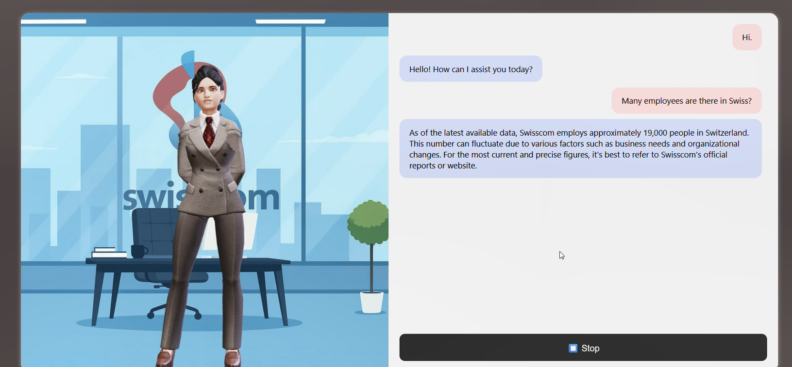
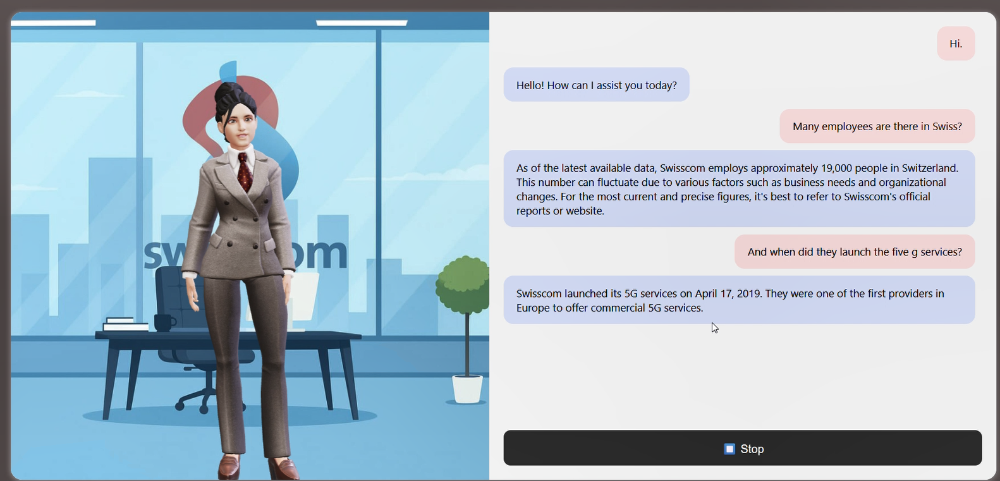
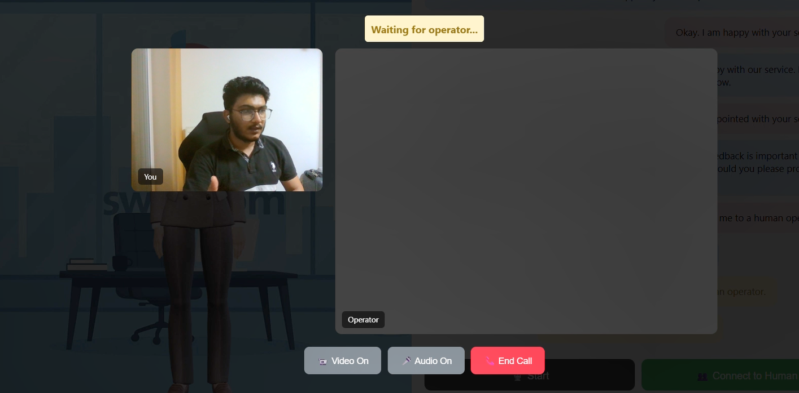
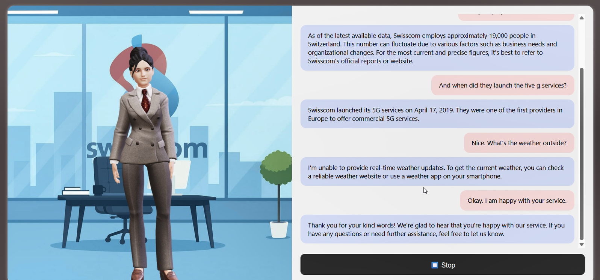
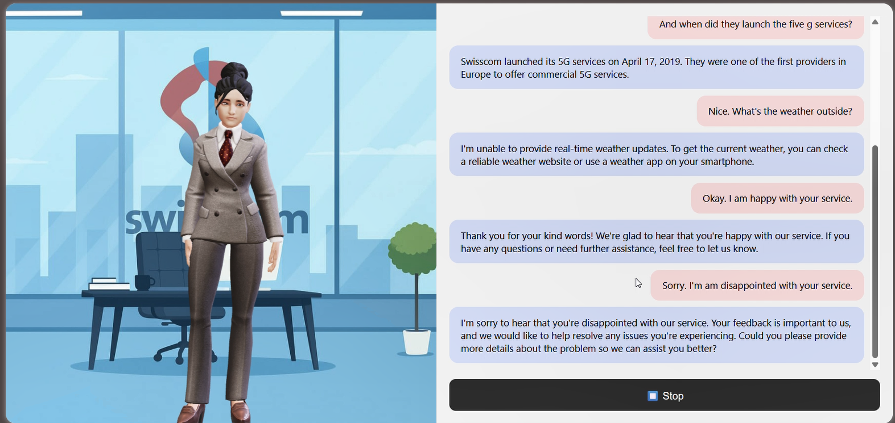

### Swisscom AI Chatbot

> An AI-powered multimodal customer support chatbot developed in collaboration with **Swisscom** as part of the **B.Sc. Artificial Intelligence** curriculum.





## 📖 Overview

The **Swisscom AI Chatbot** is an intelligent virtual assistant designed to provide customers with fast, natural, and interactive support through both **text** and **voice**.

This project was developed during our **Artificial Intelligence Project** course in collaboration with **Swisscom**, one of Switzerland's leading telecommunications companies. Throughout the development process, we had the exciting opportunity to interact directly with Swisscom representatives, including the company's CEO, receiving valuable feedback that helped shape the final product.

Unlike traditional chatbots, this system provides a more human-like interaction by combining:

- Real-time voice conversations
- AI-generated responses
- Retrieval-Augmented Generation (RAG)
- Emotion-aware avatar animations
- Customer care handoff through WebRTC

The goal was to create a customer support assistant capable of answering common questions about Swisscom's products and services while providing a natural conversational experience.

---

# ✨ Features

- Speech-to-Text conversation
- AI-generated voice responses
- Natural language conversations
- Retrieval-Augmented Generation (RAG)
- Interactive 3D avatar
- Emotion-based avatar expressions
- Real-time communication using WebSockets
- Customer support connection via WebRTC
- Company knowledge base search using FAISS
- Context-aware AI responses
- Modern web interface

---

# 🏗️ Project Architecture

```
                User
                  │
                  ▼
         🎤 Voice Input
                  │
                  ▼
      Speech Recognition (Deepgram)
                  │
                  ▼
            User Question
                  │
        ┌─────────┴─────────┐
        ▼                   ▼
   FAISS Knowledge      OpenAI API
      Retrieval       Response Generation
        └─────────┬─────────┘
                  ▼
          Final AI Response
                  │
                  ▼
      Text-to-Speech (Deepgram)
                  │
                  ▼
         Emotion Detection
                  │
                  ▼
          3D Avatar Animation
                  │
                  ▼
           🔊 Voice Output

# 🚀 Technologies Used

| Technology | Purpose |
|------------|---------|
| Python | Backend development |
| FastAPI | API development |
| WebSocket | Real-time communication |
| HTML5 | Frontend |
| Deepgram | Speech-to-Text & Text-to-Speech |
| OpenAI API | AI response generation |
| FAISS | Vector similarity search |
| all-MiniLM-L6-v2 | Sentence embedding model |
| RAG | Knowledge retrieval |
| WebRTC | Customer care connection |

---

# 🧠 AI Pipeline

The chatbot follows a Retrieval-Augmented Generation (RAG) workflow.

1. The user asks a question using voice or text.
2. Speech is converted into text using **Deepgram**.
3. The user's query is transformed into vector embeddings using **all-MiniLM-L6-v2**.
4. **FAISS** searches the company's knowledge base for the most relevant information.
5. The retrieved context is sent to the **OpenAI API**.
6. OpenAI generates an accurate and contextual response.
7. The response is converted back into speech using **Deepgram**.
8. The avatar displays an appropriate facial emotion while speaking.

---

# 😊 Interactive Avatar

One of the most unique aspects of the project is its animated avatar.

Instead of simply displaying text, the chatbot includes an expressive 3D avatar capable of changing facial expressions depending on the emotional context of the conversation.

Example emotions include:

- Happy
- Sad
- Laughing
- Neutral
- Surprised

For example:

**User:** *"The service was really bad."*

The avatar responds with a sympathetic facial expression while delivering the generated response through speech.

This creates a much more engaging and human-like interaction compared to traditional customer support chatbots.




# 🎙️ Speech Processing Journey

During the early stages of development, several speech recognition models were evaluated, including:

- Vosk
- OpenAI Whisper

As the project evolved, additional requirements such as **continuous transcription**, lower latency, and improved real-time performance became essential.

After comparing multiple solutions, **Deepgram** was selected because it offered significantly better performance for continuous voice conversations and a smoother user experience.

This iterative process allowed the chatbot to become faster, more responsive, and better suited for real-world customer interactions.

---

# 📂 Project Structure

```
Swisscom-AI-Chatbot
│
├── backend/
├── frontend/
├── data/
├── utils/
├── vectorstore/
├── static/
├── avatar/
├── requirements.txt
└── README.md

# 💻 My Contribution

My primary contribution to this project focused on the **speech interaction system**.

Responsibilities included:

- Designing and implementing the speech synthesis pipeline
- Integrating Deepgram APIs
- Implementing continuous speech recognition
- Developing the complete voice interaction workflow
- Optimizing real-time audio processing
- Improving the responsiveness of voice conversations


# 🚀 Future Improvements

Potential future enhancements include:

- Multi-language support
- Voice customization
- Advanced emotion recognition
- User authentication
- Conversation analytics dashboard
- Cloud deployment
- Mobile compatibility
- Long-term conversation memory

---

# 📜 License

This project was developed for educational purposes as part of the **B.Sc. Artificial Intelligence** program in collaboration with **Swisscom**.

---

# ⭐ Acknowledgements

A special thanks to **Swisscom** for providing the opportunity to work on a real-world AI application and for sharing valuable insights throughout the development process.

The project offered an excellent opportunity to gain hands-on experience in:

- Artificial Intelligence
- Natural Language Processing
- Retrieval-Augmented Generation
- Speech Technologies
- Real-time Web Communication
- Human-Computer Interaction

---

## 🌟 If you found this project interesting, consider giving it a ⭐ on GitHub!
